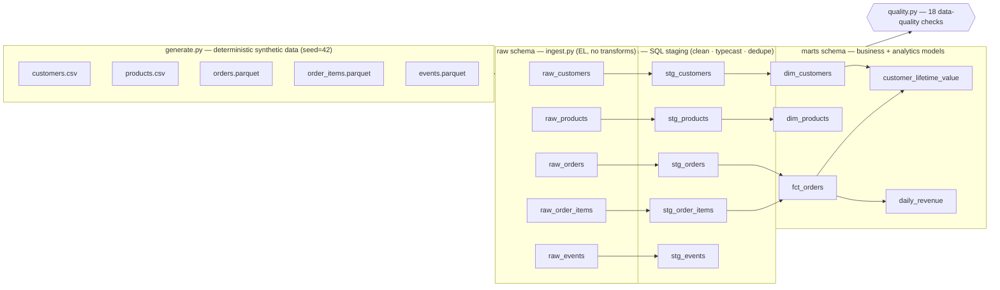
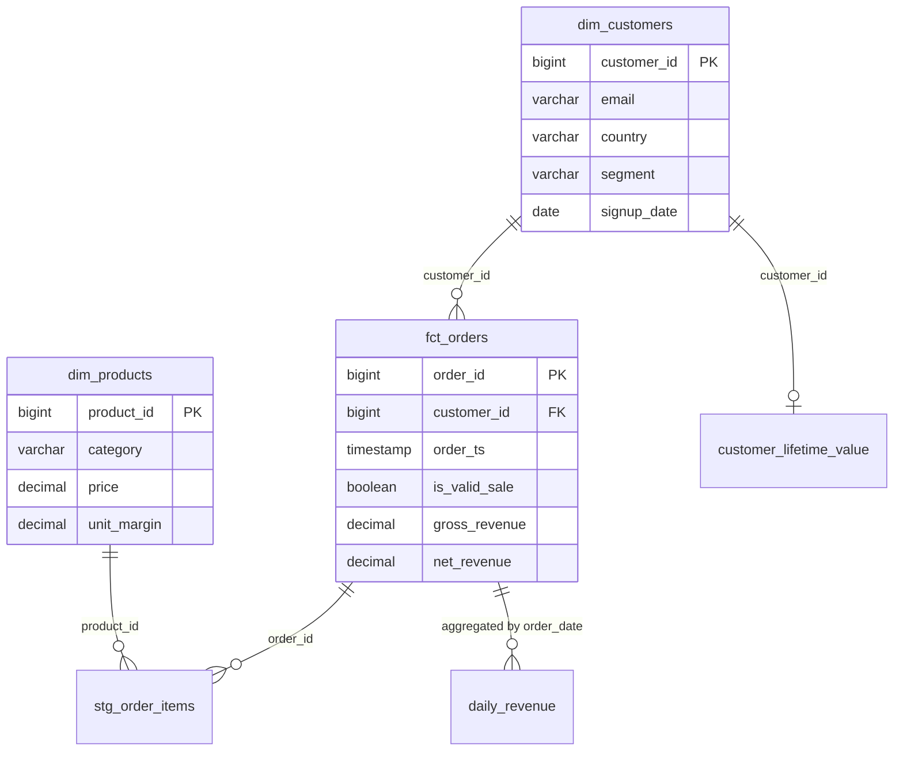

# ecommerce-data-pipeline

A production-shaped **ELT data pipeline** for e-commerce analytics, built to run
**end-to-end offline in seconds**. It generates realistic synthetic data,
ingests it into a **DuckDB** warehouse, transforms it through **layered SQL**
(raw → staging → marts), runs a **data-quality test suite**, and orchestrates
the whole thing as a **DAG** — with Prefect when available and a dependency-free
topological runner otherwise.

> **Every number in this README was produced by actually running the pipeline**
> (`python -m edp.run`). Nothing here is hand-typed or estimated. Re-run it and
> you will get the same figures — the data is generated from a fixed seed.

```
generate ──▶ ingest (EL) ──▶ transform (T) ──▶ quality tests ──▶ analytics
 synthetic     raw.*           stg.* + marts.*     18 checks       live queries
```

---

## Why this repo exists

It's the **data-engineering half** of a data/ML portfolio: the unglamorous,
high-demand work of getting trustworthy tables built and *tested* before a model
or a dashboard ever touches them. It deliberately mirrors a modern warehouse
stack (dbt-style layered SQL + dbt-tests/Great-Expectations-style checks +
Prefect orchestration) but with **zero external services and no network**, so a
reviewer can clone it and see it work in one command.

---

## Architecture (ELT)



Everything is orchestrated by `pipeline.py` as a `generate → ingest → transform
→ quality` DAG, and the warehouse is a single embedded DuckDB file
(`data/warehouse.duckdb`).

### The data model (star schema)

The marts layer is a classic star: one central fact table surrounded by
conformed dimensions, plus two pre-aggregated analytics marts.



---

## Quickstart

```bash
python -m venv .venv && source .venv/bin/activate
pip install -e ".[dev]"          # core + ruff + pytest
# optional: pip install -e ".[prefect]"   # to orchestrate with Prefect

python -m edp.run                # run the whole pipeline + print the summary
ruff check .                     # lint
pytest                           # test suite
```

No data files ship in the repo — `python -m edp.run` regenerates them
deterministically each time. The run is fully offline.

---

## Real output

### Pipeline run summary (`python -m edp.run --no-prefect`)

```
==================================================================
  E-COMMERCE ELT PIPELINE  -  RUN SUMMARY
==================================================================
  orchestrator : topological
  duration     : 0.75s

  RAW (ingested) -----------------------------------------------
    raw_customers             1,020 rows
    raw_products                200 rows
    raw_orders                5,000 rows
    raw_order_items          15,157 rows
    raw_events               22,542 rows

  MODELS (built, in dependency order) --------------------------
    stg.stg_customers                     1,000 rows
    stg.stg_events                       22,542 rows
    stg.stg_order_items                  15,157 rows
    stg.stg_orders                        5,000 rows
    stg.stg_products                        200 rows
    marts.dim_customers                   1,000 rows
    marts.dim_products                      200 rows
    marts.fct_orders                      5,000 rows
    marts.customer_lifetime_value         1,000 rows
    marts.daily_revenue                     180 rows

  DATA QUALITY -------------------------------------------------
  [PASS] unique: marts.dim_customers.customer_id
  [PASS] unique: marts.dim_products.product_id
  [PASS] unique: marts.fct_orders.order_id
  [PASS] unique: marts.customer_lifetime_value.customer_id
  [PASS] unique: marts.daily_revenue.order_date
  [PASS] not_null: marts.dim_customers.customer_id
  [PASS] not_null: marts.dim_customers.email
  [PASS] not_null: marts.fct_orders.order_id
  [PASS] not_null: marts.fct_orders.customer_id
  [PASS] not_null: marts.fct_orders.net_revenue
  [PASS] accepted_values: marts.fct_orders.status
  [PASS] accepted_values: marts.dim_customers.segment
  [PASS] relationships: marts.fct_orders.customer_id -> marts.dim_customers.customer_id
  [PASS] relationships: stg.stg_order_items.order_id -> marts.fct_orders.order_id
  [PASS] relationships: stg.stg_order_items.product_id -> marts.dim_products.product_id
  [PASS] row_count_min(1): marts.fct_orders
  [PASS] row_count_min(1): marts.dim_customers
  [PASS] freshness(2d): marts.fct_orders.order_ts

    -> 18 passed, 0 failed  [ALL CHECKS PASSED]

  ANALYTICS (live from warehouse) ------------------------------
    total net revenue : 3,721,451.70
    valid orders      : 3,326
    avg order value   : 1,118.90
    top 5 products by revenue:
      - SKU-0141   Books           44,727.52
      - SKU-0188   Books           43,819.71
      - SKU-0080   Apparel         42,624.88
      - SKU-0035   Books           41,479.28
      - SKU-0090   Home            40,795.56
    revenue by channel:
      - marketplace    942,287.95
      - web            935,276.92
      - android        929,978.15
      - ios            913,908.68
==================================================================
```

### What these numbers mean

| Metric | Value | Note |
| --- | --- | --- |
| Raw customers landed | **1,020** | includes 20 injected exact-duplicate rows |
| Customers after staging dedup | **1,000** | staging removes the duplicates (verified by a test) |
| Orders | **5,000** | spanning **2026-01-24 → 2026-07-22** (180 days) |
| Valid sales | **3,326 / 5,000** | `cancelled` / `returned` orders excluded from revenue |
| Customers with ≥1 valid order | **960** | the rest appear in CLV with zeroed metrics |
| Total net revenue | **3,721,451.70** | sum of `net_revenue` over valid sales |
| Avg order value | **1,118.90** | net revenue ÷ valid orders |
| Data-quality checks | **18 / 18 pass** | run against the built warehouse |

---

## How the layers work

### 1. `generate.py` — deterministic synthetic data
A seeded NumPy generator (`seed=42`) produces byte-identical output every run
(there's a test for it). It writes a **mix of CSV and Parquet** on purpose so the
ingest layer exercises both. It also injects **realistic dirt** — untrimmed /
mixed-case emails, un-normalised order statuses (`'COMPLETED '`, `' shipped'`),
and exact-duplicate customer rows — so the staging layer has genuine cleaning to
do. Referential integrity is kept intact in the generated data.

### 2. `ingest.py` — the EL
Loads each raw file into a `raw.*` table with DuckDB's native CSV/Parquet
readers. **No transformations here** — this preserves an honest raw layer and
explicit lineage.

### 3. `sql/staging/*.sql` — clean, typecast, dedupe
One model per source. Emails are `TRIM`+`LOWER`ed, timestamps and money columns
are cast to proper types, statuses are folded to a controlled vocabulary, and
duplicate customers are removed with a `ROW_NUMBER()` window keeping one row per
key.

### 4. `sql/marts/*.sql` — business + analytics models
`dim_customers`, `dim_products` and the central `fct_orders` fact form the star
schema; `customer_lifetime_value` and `daily_revenue` are pre-aggregated
analytics marts built on top of it. Cancelled/returned orders carry
`net_revenue = 0`, so revenue marts sum cleanly.

### 5. `transform.py` — the T, in dependency order
Rather than hard-coding an order, it **parses each SQL model's dependencies**
(which other models it references) and **topologically sorts** them — a tiny,
dependency-free version of dbt's `ref()` graph. Resolved plan:

```
stg.stg_customers → stg.stg_events → stg.stg_order_items → stg.stg_orders →
stg.stg_products → marts.dim_customers → marts.dim_products →
marts.fct_orders → marts.customer_lifetime_value → marts.daily_revenue
```

### 6. `quality.py` — data-quality tests
A small self-contained checks framework (no Great-Expectations dependency).
Each check compiles to **one SQL query returning a failing-row count** (0 =
pass), mirroring how dbt generic tests and GE expectations work. Check types:
`not_null`, `unique`, `accepted_values`, `relationships` (referential
integrity), `row_count_min`, and `freshness`. The suite in `build_suite()` reads
like a **data contract** for the star schema.

### 7. `pipeline.py` — orchestration
Runs the DAG with **Prefect if it's importable**, otherwise a clean
topological-sort runner. Detection and fallback are graceful: if Prefect fails
to import *or* errors at runtime, it logs a warning and drops to the built-in
runner. Both backends execute the **same task functions** and produce the same
result — so the pipeline is reliable with or without Prefect. The chosen backend
is recorded and printed (`orchestrator : prefect` / `topological`).

---

## Orchestration: Prefect vs. fallback

Prefect **was available and used** in local runs (`prefect 3.7.8` installed via
the optional `.[prefect]` extra):

```
  orchestrator : prefect
  duration     : 7.98s
```

The topological fallback runs the identical DAG in **~0.75s** with no server and
no dependencies:

```
  orchestrator : topological
  duration     : 0.75s
```

Prefect 3.x spins up a temporary local API server per run (the ~7s of overhead
and the extra logging), which is why **CI and the tests force the topological
runner** via `EDP_DISABLE_PREFECT=1` for speed and determinism. Prefect is an
**optional extra**, never a hard dependency — the pipeline is guaranteed to run
without it.

---

## Testing

```
$ pytest
============================= test session starts ==============================
platform linux -- Python 3.14.2, pytest-9.1.1, pluggy-1.6.0
collected 21 items

tests/test_generate.py ....                                              [ 19%]
tests/test_ingest.py .                                                   [ 23%]
tests/test_pipeline.py ...                                               [ 38%]
tests/test_quality.py .......                                            [ 71%]
tests/test_transform.py ......                                           [100%]

============================== 21 passed in 4.89s ==============================
```

The suite covers the things that actually break data pipelines:

- **Generator determinism** — same seed ⇒ byte-identical output; different seeds differ.
- **Ingest fidelity** — landed row counts equal source row counts.
- **Transform correctness** — dependency ordering, dedup (1,020 → 1,000), expected `fct_orders` columns, email cleaning, `net_revenue` rules.
- **Quality checks bite** — injecting an **orphan order**, a duplicate key, a NULL, and a bad status each make the corresponding check **fail** (proving the checks aren't vacuous).
- **Referential integrity holds** on clean data.
- **End-to-end** run via the topological backend produces a passing quality report.

---

## CI

`.github/workflows/ci.yml` runs on Python 3.11 and 3.12: install → `ruff check`
→ `pytest` → `python -m edp.run` end-to-end. CI uses the topological runner
(`EDP_DISABLE_PREFECT=1`) for a fast, deterministic build.

## Docker (optional)

```bash
docker build -t edp . && docker run --rm edp
```

Builds the warehouse and prints the run summary. No network needed at build or
run time.

---

## Project layout

```
ecommerce-data-pipeline/
├── pyproject.toml              # src layout, package `edp`, deps + [dev]/[prefect] extras
├── src/edp/
│   ├── config.py               # paths, volumes, seed (pydantic)
│   ├── generate.py             # deterministic synthetic data -> CSV/Parquet
│   ├── ingest.py               # EL: raw files -> raw.* (DuckDB)
│   ├── transform.py            # T: run layered SQL in topological order
│   ├── quality.py              # data-quality checks framework + suite
│   ├── pipeline.py             # DAG orchestration (Prefect | topological fallback)
│   ├── cli.py                  # run summary + live analytics
│   └── run.py                  # `python -m edp.run` entry point
├── sql/
│   ├── staging/                # stg_customers, stg_products, stg_orders, ...
│   └── marts/                  # dim_customers, dim_products, fct_orders,
│                               #   customer_lifetime_value, daily_revenue
├── tests/                      # 21 pytest tests
├── .github/workflows/ci.yml
├── Dockerfile
└── LICENSE                     # MIT
```

---

## Design decisions

- **DuckDB as the warehouse.** Embedded, pip-installable, columnar, speaks real
  analytical SQL (window functions, `FILTER`, `date_diff`). It gives a genuine
  warehouse experience with zero infra — ideal for a reproducible portfolio repo.
- **SQL transforms, not dbt.** The layered raw→staging→marts pattern and generic
  tests are dbt's core ideas; implementing them directly (with a topological
  planner) shows the mechanics without the dependency, and keeps the repo
  self-contained.
- **Checks compile to SQL.** One failing-row-count query per check is exactly how
  dbt tests and GE expectations evaluate — simple, fast, and transparent.
- **Prefect optional, fallback default.** Real orchestration when you want it;
  guaranteed offline reliability when you don't.
- **Intentional dirt in raw.** Cleaning that isn't tested against dirty input is
  theatre; the generator manufactures the exact problems the staging layer fixes.

---

## Honest limitations

- **Synthetic data.** Volumes and distributions are realistic in *shape* but
  drawn from simple random processes — no true seasonality, no real customer
  behaviour, no messy real-world edge cases beyond the dirt deliberately injected.
- **Single-node DuckDB.** This is an embedded, single-file warehouse. It does not
  demonstrate distributed compute, concurrency, or cloud-warehouse specifics
  (Snowflake/BigQuery partitioning, clustering, cost). The SQL is standard enough
  to port, but that port isn't shown here.
- **Full-refresh only.** Every model is `CREATE OR REPLACE TABLE` — there's no
  incremental/CDC materialisation, no slowly-changing dimensions, no backfill
  logic. That's a deliberate scope cut for clarity.
- **Prefect overhead.** Prefect 3.x starts a temporary local server per run
  (~7s), so it's opt-in and excluded from CI; the fallback runner is what CI and
  tests use.
- **No BI/serving layer.** The pipeline produces the marts; it doesn't ship a
  dashboard or an API on top of them.
- **Environment note.** Verified on Python 3.14 with DuckDB 1.5.5 and Prefect
  3.7.8. On dev machines that inject third-party `pytest` plugins via
  `PYTHONPATH` (e.g. a ROS install), run pytest with
  `PYTEST_DISABLE_PLUGIN_AUTOLOAD=1`. Clean environments and CI don't need it.

---

## License

MIT — see [LICENSE](LICENSE). © 2026 Nizar Assad.
